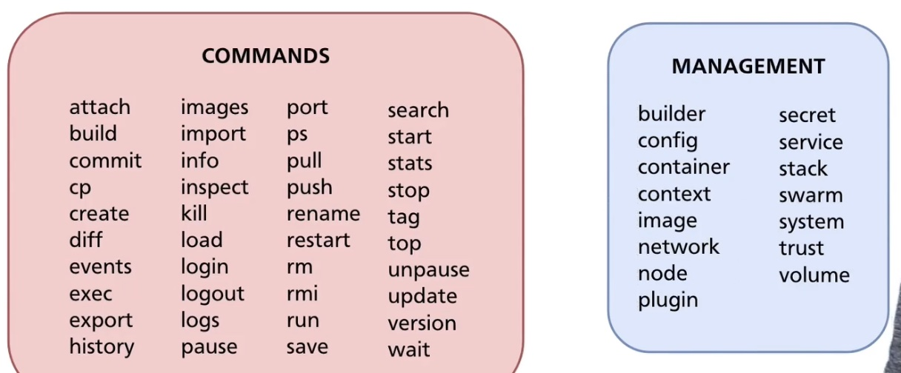
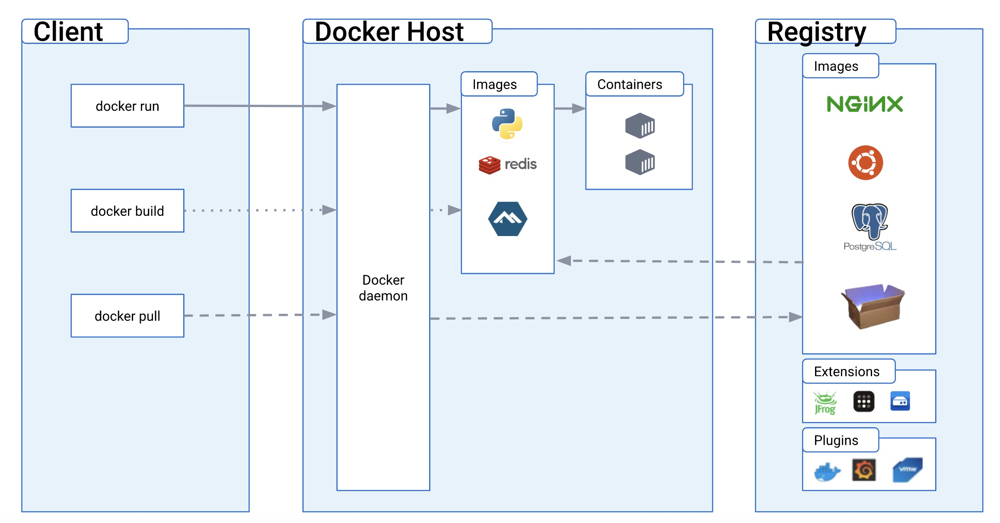

# Docker

## Docker Linux (Server) Installation
1. Follow the official installation guidelines ([Docker Linux Installation](https://docs.docker.com/engine/install/debian/)) 
2. Verify the successful installation: `sudo docker run hello-world`
3. Better practice is to execute docker as a **non-root user**. When docker is installed a docker group usually is created which grants root-level privileges to the users added. As we discussed at the `Linux-User-Group-Administration.md` we need:
    - check if a docker group exists: `cat /etc/group | grep docker` (if doesn't exist create one: `sudo groupadd docker`)
    - check the users which currently are members of the docker group: `groups docker` (if it's a new docker installation it should be empty)
    - add users to it: `sudo usermod -aG docker [USERNAME]` ([Manage Docker as a non-root user](https://docs.docker.com/engine/install/linux-postinstall/))
    - restart the server
    - verify the execution without sudo privileges: `docker run hello-world`


## Basic Docker Commands

| Command  | Description|
|---|---| 
|```docker --help```| Prints all the coomands basic commands |  
|`docker --version [OPTIONS]`| Get the current version of the docker |  
|`docker images`|Prints all the current images installed locally.|  
|`docker pull [OPTIONS] [IMAGE_NAME]`|Pull an image/repository from a registry|  
|`docker run [OPTIONS] [IMAGE_NAME]`|Create a container from an image (a new each time)|  
|`docker ps`| List all the containers currently running (plotting their IDs, Ports etc)|  
|`docker ps -a`|print all the past executed containers, the history|  
|`docker container ls -a`|print all the past executed containers, the history|  
|`docker stop [OPTIONS] [Container_ID]`|stop one or more running containers|  
|`docker restart [OPTIONS] [Container_ID]`|restart one or more containers|  
|`docker start [OPTIONS] [Container_ID]`|restart one or more containers|  
|`docker kill [OPTIONS] [Container_Name]`| kill one or more containers|  
|`docker rm [OPTIONS] [Container_Name]`| delete one or more containers|  
|`docker logs [Container_ID]`|helps debugging|  
|`docker exec -it Container_ID COMMAND`|run a command in a running container|  
|`docker exec -it Container_ID /bin/bash`|get the bash as vm as a root user|  
|`docker commit`|create a new image from the container image|  
|`docker push`|push an image or repository to a registry|  
|`docker network ls`|Available networks, used for intercommunication between containers|  
|`docker network create NETWORK_NAME`|create a docker network|  
|` `| |  

There are two categories of commands (basic commands & management commands) in management commands arguments (options) are required




Alternative Docker commands:

| Command  | Command| Description|
|---|---|---|
|`docker container ls`|`docker ps`| list of processes | 
|`docker builder build `|`docker build`| build a new image |
|`docker container inspect`|`docker inspect`| inspect specific container |
|`docker container commit`|`docker commit`| create image on specific container|
|`docker container run`|`docker run`| start a new container |
 
## Basic Docker Options


| [OPTIONS]   | Description|
|---|---| 
|`-d`| detached mode : run the container without the terminal: `docker run -d [IMAGE_NAME]`| 
|`-a`| Print container that are running and not running | 
|`- p[Host Port Number]:[Binding Port Number]`| Bind port of your host (port of the host <-- port which you exernaly send requests) to the container (port of tha you are binding this). **Port**: specifies on which port the container is listening to the incomming request. example: `docker run -p6000:6379 [IMAGE_NAME]`| 


# Docker Architecture

Docker uses a Client/Server Architecture. The Docker Client (AKA **docker**) talks to the Docker Server/Host (AKA **daemon**):
- **Client/docker**: is the primary way that users interact with Docker. By using commands (example: `docker pull [OPTIONS] [IMAGE_NAME]`) the client sends these requests to Server/daemon, which carries them out. The Docker Client can communicate with more than one Server/daemon.
- **Server/daemon**: manages objects such as images, containers, networks, and volumes. Basically daemon does the heavy lifting of building, running, and distributing your Docker containers. A daemon can also communicate with other daemons to manage Docker services.
- Client and Server/daemon can run on the same system, or you can connect a Docker client to a remote Docker Server/daemon. 
- Client and Server/daemon communicate using a **REST API**, over UNIX sockets or a network interface.
- **Docker Compose** is a type of Client, that lets you work with applications consisting of a set of **containers**.
- **Registry**: stores Docker **images**. Docker Hub is a public registry, and Docker is configured to look for images on Docker Hub by default. By using commands such as `docker pull [OPTIONS] [IMAGE_NAME]` or `docker run [OPTIONS] [IMAGE_NAME]`, the required images are pulled from your configured registry. When you use the `docker push` command, your image is pushed to your configured registry.



## Docker objects

- **Container**: is an **isolated** place where an **application** runs without affecting the rest of the system and without the system impacting the application. Because they are isolated, containers are well-suited for securely running software like databases or web applications that need access to sensitive resources without giving access to every user on the system.
    - Containers run natively on Linux and shares the host machine’s kernel, they are **lightweight**, not using more memory than other executables. If you stop a container, it will not automatically restart unless you configure it that way. Containers can be much **more efficient** than virtual machines because they don’t need the overhead of an entire operating system. They share a single kernel with other containers and boot in seconds instead of minutes.
    - Use containers for **packaging an application** with all the components it needs, then ship it all out as one unit. This approach is popular because it eliminates the friction between development, QA, and production environments, enabling faster software shipping. Building and deploying applications inside software containers eliminates “works on my machine” problems when collaborating on code with fellow developers.
    - You can **create**, **start**, **stop**, **move**, or **delete** a container using the **Docker API** or CLI. You can connect a container to one or more networks, attach storage to it, or even create a new image based on its current state.
    - **Container Layers** Each time Docker launches a container from an image, it adds a thin writable layer, known as the container layer, which stores all changes to the container throughout its runtime. As this layer is the only difference between a live operational container and the source Docker image itself, any number of like-for-like containers can potentially share access to the same underlying image while maintaining their own individual state.

- **Image**: is a read-only template with instructions for creating a Docker container. Think of an image like a **blueprint** or snapshot of what will be in a container when it runs. Basically an image bundles together all the essentials such as installations, application code, and dependencies in order to execute code in a Docker container.
    - Docker **container as a running image instance**. You can create many containers from the same image, each with its own unique data and state.
    - Often, an image is based on another image, with some additional customization (i.e. build an image which is based on the ubuntu image, but installs the Apache web server).
    - To build an image, you create a **Dockerfile** with a simple syntax for defining the steps needed to create the image and run it. Each instruction in a Dockerfile creates a **layer in the image**. When you change the Dockerfile and rebuild the image, only those layers which have changed are rebuilt. This is part of what makes images so lightweight, small, and fast, when compared to other virtualization technologies.

    - **Image Layers** Each of the files that make up a Docker image is known as a layer. These layers form a series of intermediate images, built one on top of the other in stages, where **each layer is dependent on the layer immediately below it**. The **hierarchy of your layers is key to efficient** lifecycle management of your Docker images. Thus, you should organize layers that change most often as high up the stack as possible. This is because, when you make changes to a layer in your image, Docker not only rebuilds that particular layer, but all layers built from it.  
        - Change to a layer at the top of a stack involves the least amount of computational work to rebuild the entire image.
        - **Parent Image** is the first layer of a Docker image.  It’s the foundation upon which all other layers are built and provides the basic building blocks for your container environments.
            - A typical parent image may be a stripped-down Linux distribution or come with a preinstalled service
        - **Base image** is an empty first layer, which allows you to build your Docker images from scratch; give you full control over the contents of images.
    
    
## Docker Execution Process (Interactive Example)

The following happens When you run this command: `docker run -i -t ubuntu /bin/bash`:

1. Starts by **searching a local image** of `ubuntu`. If you do not have the ubuntu image locally, **Docker pulls** it from your configured registry, as though you had run `docker pull ubuntu` manually. So a local image is created (if it doesn't exist) and pointed at via the IMAGE ID reference 

2. Docker creates a **new container** with a new container ID based on the aforementioned image, as though you had run a docker container create command manually.

3. Docker allocates a **read-write filesystem** to the container, as its **final layer**. This allows a running container to create or modify files and directories in its local filesystem.

4. Docker creates a **network interface** to connect the container to the default network, since you did not specify any networking options. This includes assigning an IP address to the container. By default, containers can connect to external networks using the host machine’s network connection.

5. Docker **starts the container and executes /bin/bash**. Because the container is running interactively and attached to your terminal (due to the -i and -t flags), you can provide input using your keyboard while the output is logged to your terminal.

6. When you type **exit to terminate the /bin/bash command**, the container stops but is not removed. You can start it again or remove it.


## Basic Docker `-it` Option (Interactive Example)

- Without [Option] --> `docker run ubuntu`
    - Searches for Ubuntu image(copy from registry if none)
    - Creates a container from this image (a new container with a new ID)
    - **Immediately terminates** (as there is no such a container in `docker ps`) because there is no command (processes) after the creation of the container that required to be executed. 
    - Nevertheless this container was executed correctly and completely as there is such a container process in history: `docker ps -a`
    
- With [Option]= `-it` --> `docker run -it ubuntu`
    - Searches for Ubuntu image(copy from registry if none)
    - Creates a container from this image (a new container with a new ID)
    - You have a bash/shell access as a root user with system name the container ID.
    - this shell is not your server's shell, it is a fully isolated new system with a new shell access
    - if you open a new terminal and execute `docker ps` you will see this container running
    - you may exit this shell, as usual with `exit` command and then also from the `docker ps` with be terminated.
    


## Docker Images Creation

You can create a Docker image by using one of two methods:
- **(1) Interactive**: By running a container from an existing Docker image (example run ubuntu: `docker run -it ubuntu`), manually changing that container environment through a series of live steps (example update: `apt-get update`), and saving the resulting state as a new image (find the container's id after the installation and from another terminal execute: `docker commit containers_id`) you will find this update container as a new image when you execute: `docker images`.
    - Advantages: Quickest and simplest way to create Docker images. Ideal for testing, troubleshooting, determining dependencies, and validating processes.
    - Disadvantages: Difficult lifecycle management, requiring error-prone manual reconfiguration of live interactive processes.  Create unoptimized images with unnecessary layers.

- **(2) Dockerfile**: By constructing a plain-text file, known as a Dockerfile, which provides the specifications for creating a Docker image; **like a blueprint**. This is a three-step process whereby you create the Dockerfile and add the commands you need to assemble the image.
    - Advantages: Clean, compact and repeatable recipe-based images. Easier lifecycle management and easier integration into continuous integration (CI) and continuous delivery (CD) processes. Clear self-documented record of steps taken to assemble the image.
    - Disadvantages: More difficult for beginners and more time consuming to create from scratch.


## Dockerfile Example Basic

Docker can **build images** automatically by reading the instructions from a Dockerfile. A Dockerfile is a text document that contains all the commands a user could call on the command line to assemble an image. Dockerfile is the blueprint of your project. Example `Dockerfile`:

- **(0.a) Project Directory Creation**
 
    A. Make a folder with the files used in this Docker image
    B. `cd` to this Directory

- **(1) Create a Dockerfile**

    A. Create a file named `DockerFile`
    B. Include the following lines in the `DockerFile` file: 

    ```
    FROM ubuntu
    WORKDIR /home/admin/docker_projects/[DIRECTORY_NAME]
    RUN apt-get update
    ENTRYPOINT pwd
    ```

- **(2) Build an image** based on this dockerfile:

    A. After saving the `DockerFile` file and while you are inside this directory execute:

    `docker build -t [MY_IMAGE_NAME]:[VERSION_NUMBER] .`

- **(3) Run the image** as a container:

    `docker run [MY_IMAGE_NAME]:[VERSION_NUMBER]`


The following table shows you those Dockerfile statements you’re most likely to use:

| Command   | Purpose - Description|
|---|---| 
| `FROM <image>:<tag>` | (*Must included*) Specify the parent image| 
| `MAINTAINER <name>` | (*Optional*) set the Author field of the generated images| 
| `WORKDIR </path/to/workdir>` | (*Best Practice*) Set working directory for any commands that follow in the Dockerfile \* | 
| `ARG <key> <value>` | (*Optional*) Pass Docker Environment Variables During The Image Build  with `--build-arg`| 
|`RUN <command>` | (*Must included*) To install any applications and packages required for your container. \* | 
|`COPY <src> <dest>` |To copy over files or directories from a specific location. | 
|`ADD <src> <dest>` |As COPY, but also able to handle remote URLs and unpack compressed files.| 
| `ENV <key> <value>` | (*Optional*) Pass Docker Environment Variables afterwards once the container runs with `--env`| 
|`ENTRYPOINT <command> <param1> <param2>` | Command that will always be executed when the container starts. If not specified, the default is /bin/sh -c| 
| `CMD <command> <param1> <param2>` | Arguments passed to the entrypoint. If ENTRYPOINT is not set (defaults to /bin/sh -c), the CMD will be the commands the container executes. | 
|`EXPOSE <port>` | To define which port through which to access your container application.| 
|`LABEL <key>=<value>` |To add metadata to the image| 
| | | 

\* You can have multiple WORKDIR instructions in your Dockerfile which are build as the layers go down

\* the RUN statements in your Dockerfile are only executed during the build stage, i.e. using docker build and not with docker run


## Environment Variables

Docker ENV and ARG are pretty similar, but not quite the same.
- ARG can be set during the image build with `--build-arg` 
- ENV can be set during the container running with `--env`


## Dockerfile Example Environment Variables

- **(0.a) Project Directory Creation**
 
    A. Make a folder with the files used in this Docker image
    B. `cd` to this Directory

- **(1) Create a Dockerfile**

    A. Create a file named `DockerFile`
    B. Include the following lines in the `DockerFile` file: 

    ```
    FROM ubuntu
    WORKDIR /home/admin/docker_projects/proj2

    ARG my_arg
    RUN echo $my_arg
    
    ENV my_var=$my_arg
    ENTRYPOINT echo $my_var
    ```

- **(2) Build an image** based on this dockerfile:

    After saving the `DockerFile` file and while you are inside this directory execute:

    `docker build -t my_proj2 --build-arg my_arg="TEST_VAR" .`
    
    As you will see during the build the value TEST_VAR will be printed

- **(3) Run the image** as a container:

    A. **Without** Environment Variable

    ` docker run my_proj2`
    
     As you will see the value **TEST_VAR** will be printed
    
     B. **With** Environment Variable

    ` docker run --env my_var='TEST_VAR2' my_proj2`
    
     As you will see the value **TEST_VAR2** will be printed

 
    
[Pass Docker Environment Variables During The Image Build](https://vsupalov.com/docker-build-pass-environment-variables/)


   

ENV values are accessible during the build, and afterwards once the container runs. You can set ENV values in your Dockerfile - either by hardcoding them, or in a dynamic fashion.


ENV values are accessible during the build, and afterwards once the container runs. 


## Docker Compose
Compose is a tool for defining and running multi-container Docker applications with just one file. With Compose, you use a **YAML** file to configure your application’s services. Then, with a single command, you create and start all the services from your configuration. For example for the mongodb we executed above we create a file name `mongo.yaml` and include the following translation:

```
version: '3'
services:
    mongodb:
        image: mongo
        ports:
            - 27017:27017
        environment:
            - MONGO_INITDB_ROOT_USERNAME=admin
            - MONGO_INITDB_ROOT_PASSWORD=password
        mongo-express:
            image: mongo-express
        ports:
            - 8080:8081 
        environment:
            - ME+CONFIG MONGODB_ADMINUSERNAME=admin
            - ME_CONFIG_MONGODB_ADMINPASSWORD=password
            - ME_CONFIG_MONGODB_SERVER=mongodb
```

Execute the command (no containers should be running): `docker-compose -f mongo.yaml up` and 


# References

- [Video - The Complete Practical Docker Guide](https://subscription.packtpub.com/video/cloud-networking/9781803247892)
- [Docker overview](https://docs.docker.com/get-started/overview)
- [Docker image vs container](https://circleci.com/blog/docker-image-vs-container/)
- [Understanding and Building Docker Images](https://jfrog.com/knowledge-base/a-beginners-guide-to-understanding-and-building-docker-images/)
- [Dockerfile](https://kapeli.com/cheat_sheets/Dockerfile.docset/Contents/Resources/Documents/index)

```{ - [Text](https:///.com) }
```

