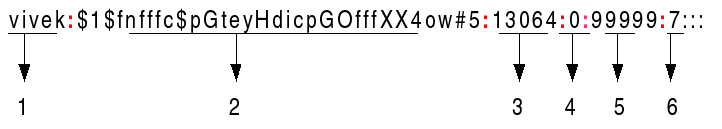

# User & Group Management

Proper User Account Management enables Linux to enforce access controls (permissions) and audit who does what on the system. This authentication provides access to resources and a customized, user-specific environment.

By running the basic command `ls -l` in any Linux directory, you can see a quick overview of each file or directory that is a part of that directory, including its size, last modification date, owner (user), group membership, and access mode:


As Linux administrator you can modify those permissions


# Users Management

Users must authenticate to any system they need to use. The user's identity is based on their user account. 

| Command  | Description|
|---|---| 
| ```whoami```   | My current username (the user I am currently logged in)  | 
|`ls -l /home`| print currently logged in users' home directories |  
|`users`| list of all users  currently logged in according to system (actual users not system users) |  
|```exit```| Leave user you logged in (or if you are admin exit from server)|  
|```su - [USERNAME]``` OR ```sudo -i [USERNAME]]```| change user to the user with name: [USERNAME] |
|```sudo getent group sudo```| list of accounts that belong to the sudo Permissions|  


### `/etc/passwd` File:
An Important File for System User Management contains **All Users Information** (Actual users & System* Users)
- `cat /etc/passwd`: prints All Users info 
    - `cat /etc/passwd | wc -l`: prints the number of all users
    - `cat /etc/passwd | grep [USERNAME]`: print the line of the particular [USERNAME]

### `/etc/passwd` Fields: 
Contains one entry per line for each user. Fields are separated by a colon (:) symbol. Total of seven fields as follows: 


1. **Username**: It is used when user logs in. 
    - It should be between 1 and 32 characters in length.
1. **Password**: An x character indicates that encrypted password is stored in `/etc/shadow` file. 
1. **User ID (UID)**: Each user must be assigned a user ID (UID). 
    - UID 0 (zero) is reserved for root 
    - UIDs 1-99 are reserved for other predefined accounts-
    - UIDs 100-999 are reserved by system for administrative and system accounts/groups.
    - UIDs 1000+ are reserved for user accounts (admin user has usually UID: 1000)
1. **Group ID (GID)**: The **primary** group ID (stored in /etc/group file)
1. **User ID Info (GECOS)**: The comment field. It allow you to add extra information about the users.
    - such as user’s full name, phone number etc. This field use by finger command.
1. **Home directory**: The absolute path to the directory the user will be in when they log in. 
    - If this directory does not exists then users directory becomes `/`
1. **Command/shell**: The absolute path of a command or shell 
    - For **User Accounts** the (`/bin/bash`) is a typical shell
    - For **Systme Accounts** (sysadmin) nologin shell are used (`/sbin/nologin`), which acts as a replacement shell for the user accounts. If shell set to /sbin/nologin and the user tries to log in to the Linux system directly, the /sbin/nologin shell closes the connection.

**Notes:**

- System Users: are going to run in the background, schedule tasks processes etc.
- In the `/etc/shadow` file (hashed password is not the actual password it the hashed version).


### Add Users (Actual Users & System Users):

 | Command  | Description|
 |---|---| 
 |` sudo useradd [USERNAME]`| add a new user with name: [USERNAME] and no home directory (if you are admin no sudo needed) |  
 |` sudo useradd -m [USERNAME]`| add a new User with [USERNAME] AND a home directory (if you are admin no sudo needed)|  
 |` sudo useradd -r [USERNAME]`| add a new SYSTEM User with [USERNAME] (this type of user has ID under 1000 ** |  

**Notes**:
- You may change the default way that you add users via `cat /etc/default/useradd` which sets the defaults for user's add.


### Remove Users (Actual Users & System Users):

 | Command  | Description|
 |---|---| 
 |`sudo userdel [USERNAME]`| deletes the user with name: [USERNAME] |  
 |`sudo userdel -f [USERNAME]`| deletes the user with name: [USERNAME] AND their home directory |  

 
 
### Set Password for Users 

When you create a user as admin you didn't set a password for this user so you need an additional command

| Command  | Description|
|---|---| 
|```sudo passwd [USERNAME]```| Change userpassword |  
 

### Modify Users' info:

| Command  | Description|
|---|---| 
|```sudo usermod -aG [GROUPNAME] [USERNAME]```| Add a user [USERNAME] to a group [USERNAME]|  
|```sudo usermod -g [GROUPNAME] [USERNAME]```| Change the primary group of the user |  
|```sudo usermod -d [USERNAME] [GROUPNAME]```| Removing a user from a Group |  
|```sudo usermod -L [USERNAME]```| Lock user account |  
|```sudo usermod -U [USERNAME]```| Unlock user account |  
|```sudo usermod -e [YYYY-MM-DD] [USERNAME]```| Set an expiry date to the user account |  
|```sudo usermod -u [UID] [USERNAME]```|  Change the UID of a user |  
|```sudo usermod -l [NEW_USERNAME] [OLD_USERNAME]```| Change the name a user|  
|```sudo usermod -md [NEW_HOME_DIR] [USERNAME]```| You can change the home directory of the user to another directory|  
|```sudo usermod -s [NEW_SHELL_PATH] [USERNAME]```| Change the default shell of a user |  

**Notes:**
- You may execute the same command with the `gpasswd` command (i.e. `sudo gpasswd -aG [GROUPNAME] [USERNAME]` 

 
### `/etc/shadow` File:

Stores the hashed passphrase (or “hash”) format for Linux user account with additional properties related to the user password

- `cat /etc/shadow`: prints All Users hash passwords with additional properties 
    - `cat /etc/shadow | wc -l`: prints the number of all users hash passwords
    - `cat /etc/shadow | grep [USERNAME]`: print the line of the particular [USERNAME]

### `/etc/passwd` Fields: 
Contains one entry per line for each user. Fields are separated by a colon (:) symbol. Total of seven fields as follows: 


  
1. **Username**: A valid account name, which exist on the system.
2. **Password**: Your encrypted password is in hash format. 
- The password should be minimum 15-20 characters long including special characters, digits, lower case alphabetic and more. 
3. **Last password change (lastchanged)**: The date of the last password change, expressed as the number of days since Jan 1, 1970 (Unix time). 
- The value 0 has a special meaning, which is that the user should change her password the next time she will log in the system. An empty field means that password aging features are disabled.
4. **Minimum**: The minimum number of days required between password changes i.e. the number of days left before the user is allowed to change her password again. An empty field and value 0 mean that there are no minimum password age.
5. **Maximum**: The maximum number of days the password is valid, after that user is forced to change her password again.
6. **Warn**: The number of days before password is to expire that user is warned that his/her password must be changed
7. **Inactive**: The number of days after password expires that account is disabled.
8. **Expire**: The date of expiration of the account, expressed as the number of days since Jan 1, 1970.
 
 
# Group Management 

It's more efficient to group user accounts with similar access requirements than to manage permissions on a user-by-user basis. Therefore, system administrations need to be comfortable with the process of creating, modifying, and deleting groups.

 | Command  | Description|
 |---|---| 
 |```groups```| list the groups which the current user is a member of with the first one being the primary|  
 |```groups [USERNAME]```| list the groups which the [USERNAME] is a member of  with the first one being the primary|  
 
**Notes:**
- Each user from the `/etc/passwd` file belongs to one primary group. There is no difference between **primary** and **supplementary** groups, any of the groups can be primary and/or supplementary, it is just a reference, if a particular group is assigned to a user in the `/etc/passwd` as the one (primary) group.


### `/etc/group` File:
Similar to the `/etc/passwd` file above, the `/etc/group` file contains group account information:
- `cat /etc/group`: prints All Groups info 
    - `cat /etc/group | wc -l`: prints the number of all groups
    - `cat /etc/group | grep [GROUP_NAME]`: print the line of the particular [GROUP_NAME]

### `/etc/group` Fields: 
Contains one entry per line for each group. Fields are separated by a colon (:) symbol. Total of seven fields as follows: 


`groupname:group-password:GID:username-list`

1. **groupname**: Contains the name assigned to the group.
2. **group-password (x)**: x in this field indicates that shadow passwords are used.
3. **GID**: Contains the group’s GID number.
4. **username-list**: List of users that are members of the group


### Add Groups:

 | Command  | Description|
 |---|---| 
 |`sudo groupadd [GROUP_NAME]`| Add a group account with name: [GROUP_NAME] |  


**Notes:**
- When you create a new user a new group with this user name is created as well
- Best practices is not used use group password

### Remove Groups:

 | Command  | Description|
 |---|---| 
 |`sudo groupdel [GROUP_NAME]`| deletes the group with name: [GROUP_NAME] |  
 |`sudo userdel -f [USERNAME]`| deletes the user with name: [USERNAME] AND their home directory |  


### Practical Groups Management Examples:

#### **SSH Group**:
A practical example of group management is to give SSH access to users. In the `/etc/ssh/sshd_config` file, you can modify who can access the server via the SSH command by including the line `AllowUsers [USERNAME_A] [USERNAME_B] [USERNAME_C]`. However, instead of adding or removing each user every time in this file, which may cause you to forget someone, it is better practice to include the line `AllowGroups [SSH-ACCESS-GROUP]` and add all the users you want to this particular group `[SSH-ACCESS-GROUP]`.


### Changing ownership to another USER & to Group

| Command  | Description|
|---|---| 
|`chown -R [NEW_USERNAME] [dir]`| Change the ownership of [dir] to the new [NEW_USERNAME] |
|`chown -R [NEW_USERNAME]:[NEW_GROUPNAME] [dir]`| Change the ownership of [dir] to the new [NEW_USERNAME] and to new [NEW_GROUPNAME] |

# Permissions

File permissions define which user or system accounts have permissions to read, write, and execute specific files.

By executing the command `ls -l` you see in the first column the permission information: 


Type of file (i.e. file, directory, etc) and the permissions read (**r**), write (**w**), and execute (**x**) for **user**, **group**, and **other** (in that order)

**File Types**: `-`: = Regular File; `d` = Directory; `l` = Symbolic Link; `b` = Block Special Device; `c` = Character Device; `s` = Unix Socket (local domain socket); `p` = Named Pipe

### Setting Permissions

The symbolic method uses the following syntax:

 | Command  | Description|
 |---|---| 
 |`chmod WhoWhatWhich [filename] or [dir]`| Set Up Permissions on [filename] or [dir] |  

Where:

* `Who` - represents identities: `u`,`g`,`o`,`a` (user, group, other, all)
* `What` - represents actions: `+`, `-`, = (add, remove, set exact)
* `Which` - represents access levels: `r`, `w`, `x` (read, write, execute)

An example adding read and write permissions to a file named [filename] for user and group: `chmod ug+rw [filename]`


### Setting Permissions with numerical method

The numeric method is based on the following syntax with 3 digits:

 | Command  | Description|
 |---|---| 
 |`chmod ### [filename] or [dir]`| Set Up Permissions ### on [filename] or [dir] |  

From left to right, each of the 3 character # represents an access level to a Specific level: user, group, and others. To determine what each digit is, we sum the values of each digit:

* Start at 0
* If the read permission should be set, add 4
* If the write permission should be set, add 2
* If the execute permission should be set, add 1

An example adding `-rw-r-x---`to a file named [filename] for user and group: `chmod 650 [filename]` where 1st digit 6=4+2(w+r); 2nd digit 5=4+1(r+x); 3rd digit 0=0(no permission)


### Special Permissions

Special permissions make up a fourth access level in addition to user, group, and other. Special permissions allow for additional privileges over the standard permission:
- **SUID**: (replaces `x` with `s` or `S`) special permission for the user access level has a single function: A file with SUID always executes **as the user who owns the file, regardless of the user passing the command**: `-rwsr-xr--`. If the file owner doesn't have execute permissions, then use an uppercase S here `-rwSr-xr--`. 
- **SGID**: (replaces `x` with `s` or `S`) If set on a file, it allows the file to be executed as the group that owns the file (similar to SUID): `-rwxr-sr--` or `-rwxr-Sr--`. If set on a directory, any files created in the directory will have their group ownership set to that of the directory owner: `drwxrws---`.
    - It is especially useful for directories that are often used in collaborative efforts between members of a group. Any member of the group can access any new file. This applies to the execution of files, as well. 
- **Sticky Bit**: (replaces `x` with `t`) This permission does not affect individual files. affects **directory level**, it restricts **file deletion**. Only the owner (and root) of a file can remove the file within that directory. A common example of this is the `/tmp` directory: `drwxrwxrwt`

### Setting Special Permissions

 | Command  | Description|
 |---|---| 
 |`chmod u+s [filename]`| Set Up Setuid (SUID) on [filename] |  
 |`chmod g+s [filename]`| Set Up Setgid (SGID) on [filename] | 
 |`chmod g+s [dir]`| Set Up Setgid (SGID) on [[dir]] | 
 |`chmod +t [dir]`| Set Up Sticky Bit on [[dir]] | 
 

### Setting Special Permissions with numerical method

We need to pass a fourth, preceding digit in our chmod command: 

 | Command  | Description|
 |---|---| 
 |`chmod X### [filename] or [dir]`| Set Up Special Permissions on [filename] or [dir]|  

Where `X` has the following options:
* Start at 0
* SUID = 4
* SGID = 2
* Sticky = 1


 
**References**: 
- [How to manage users and groups in Linux](https://www.redhat.com/sysadmin/linux-user-group-management)
- [Video: Linux Crash Course - Managing Users](https://www.youtube.com/watch?v=19WOD84JFxA)
- [Understanding /etc/passwd File Format](https://www.cyberciti.biz/faq/understanding-etcpasswd-file-format/)
- [Understanding /etc/shadow file format on Linux](https://www.cyberciti.biz/faq/understanding-etcshadow-file/)
- [Understanding /etc/group file](https://www.thegeekdiary.com/etcgroup-file-explained/)
- [Video: Managing Groups](https://www.youtube.com/watch?v=GnlgAD8-GhE)
- [CAMMS Linux-Commands](https://github.com/jasonjamsden/CAMMS_Tutorials/tree/main/Linux-Commands)
- [Linux File Permissions, chmod, & umask](https://tutonics.com/2012/12/linux-file-permissions-chmod-umask.html)
- [Linux permissions: SUID, SGID, and sticky bit](https://www.redhat.com/sysadmin/suid-sgid-sticky-bit)
- [Text](https:///.com)

